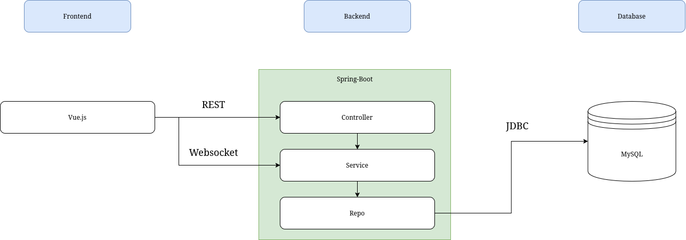
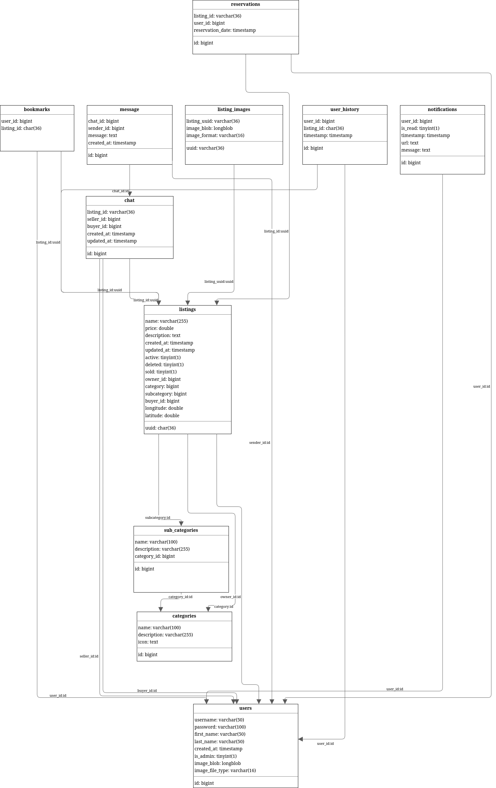
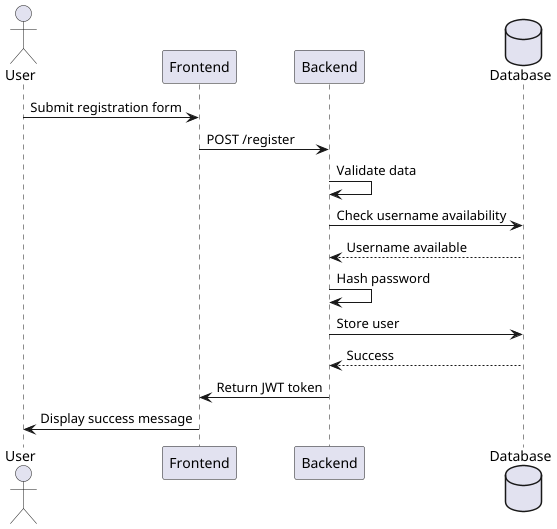
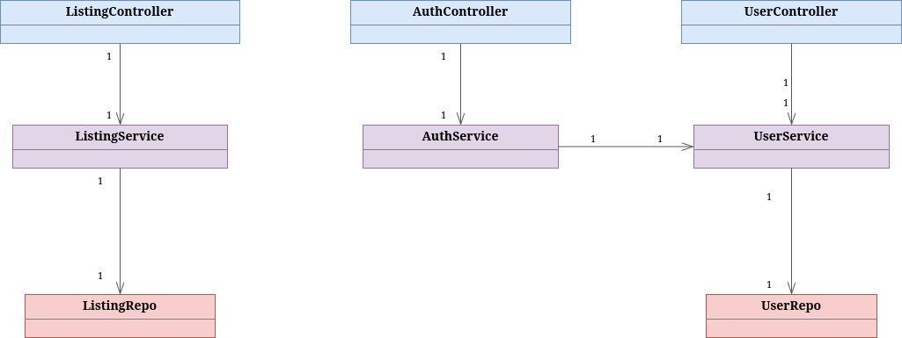

# IDATT2015 prosjektoppgave

## Contributors
- Markus Stuevold Madsbakken
- Nikolai Tandberg
- Jacob Lein
- Erik Hoff

## Table of contents
- [IDATT2015 prosjektoppgave](#idatt2015-prosjektoppgave)
  - [Contributors](#contributors)
  - [Table of contents](#table-of-contents)
  - [Project description](#project-description)
    - [Technology Stack](#technology-stack)
    - [Key Features](#key-features)
    - [Project Goals](#project-goals)
  - [Project structure](#project-structure)
    - [System architecture](#system-architecture)
    - [Entity-relationship diagram](#entity-relationship-diagram)
    - [System sequence diagram](#system-sequence-diagram)
    - [limited class diagram](#limited-class-diagram)
    - [Frontend file structure](#frontend-file-structure)
    - [Backend file structure](#backend-file-structure)
  - [Requirements](#requirements)
  - [Setup](#setup)
      - [Setup local environment](#setup-local-environment)
      - [Install and select a Database](#install-and-select-a-database)
  - [Installation](#installation)
  - [Usage](#usage)
  - [Testing](#testing)
  - [Building for production](#building-for-production)
      - [Building with H2](#building-with-h2)
      - [Examples](#examples)
  - [Further documentation](#further-documentation)
  - [Future work](#future-work)


## Project description
This project is an e-commerce marketplace web application similar to "finn.no", developed as part of the IDATT2105 Full-stack Application Development course. The platform allows sellers to list items for sale and buyers to browse, search, and purchase these items through various interactive features.
### Technology Stack
- Frontend:
  - npm (v18.16.0) for package management
  - Vue.js (v3) framework with custom CSS (no frameworks like Tailwind)
  - PrimeVue for UI components
  - Vue Query for data fetching and caching
  - Pinia for state management
  - i18n for internationalization/translation support
  - Cypress for end-to-end testing
- Backend:
  - Java v21 with Spring Boot/Spring Framework
  - Maven for dependency management
  - JUnit for unit testing
  - Mockito for mocking dependencies in tests
  - JDBC for database access
  - Swagger through OpenAPI for REST API documentation
  - JaCoCo for test coverage reporting
  - SLF4J for logging
- Database
  - MySQL (v8.1) for production
  - H2 for testing
  - Flyway for database migration
- Authentication: JWT and Spring Security
### Key Features
User authentication system with role-based access (normal users and administrators)
Item listing with detailed product information, images, and location data
Advanced search and filtering capabilities by categories, name, and other parameters
Interactive item views (thumbnail and map views) with pagination support
Bookmarking system for users to save favorite items
In-app messaging between buyers and sellers
Mobile-responsive design
Internationalization support for multiple languages
Administrative tools for managing categories

### Project Goals
The aim of this project is to demonstrate full-stack development capabilities by creating a functional e-commerce marketplace with robust frontend and backend integration. The application follows industry best practices including OWASP security standards and universal design principles while maintaining comprehensive test coverage and documentation.

## Project structure
### System architecture


### Entity-relationship diagram


### System sequence diagram


### limited class diagram


### Frontend file structure
```plaintext
src
├── actions
├── assets
├── components
│   ├── admin
│   ├── icons
│   ├── profile
│   ├── register
│   └── skeleton
├── router
├── stores
├── types
├── util
└── views
    ├── chat
    └── userListings
```

### Backend file structure
```plaintext
.
├── src
│   ├── main
│   │   ├── java
│   │   │   └── edu
│   │   │       └── ntnu
│   │   │           └── stud
│   │   │               ├── config
│   │   │               ├── controller
│   │   │               ├── exception
│   │   │               ├── factory
│   │   │               ├── filter
│   │   │               ├── model
│   │   │               │   ├── base
│   │   │               │   ├── request
│   │   │               │   ├── response
│   │   │               │   └── update
│   │   │               ├── repo
│   │   │               ├── service
│   │   │               └── util
│   │   └── resources
│   │       └── db
│   │           └── migration
│   └── test
│       ├── java
│       │   └── edu
│       │       └── ntnu
│       │           └── stud
│       │               ├── repo
│       │               ├── service
│       │               └── util
│       └── resources
│           └── db
│               └── testmigrations
└── target
```
## Requirements
- Java 21 (JDK) for backend development
- Maven for backend dependency management
- Node.js for frontend development

## Setup
#### Setup local environment
To run the project, you need to set up a .env file with the following properties:
- SPRING_DATABASE_DRIVER: The database driver to use (either com.mysql.cj.jdbc.Driver or org.h2.Driver)
- SPRING_DATABASE_URL: The URL of the database to connect to (more on this below)
- SPRING_DATABASE_USERNAME: The username to use for the database connection
- SPRING_DATABASE_PASSWORD: The password to use for the database connection
See the '.env.local.example' file in the root directory for an example of how to set up the .env file. You can copy this file to .env.local and fill in the values.
#### Install and select a Database
There are two database solutions that are preconfigured in this project:
- MySQL server: Run a separate MySQL server instance and configure the env variables to connect to it. Choose com.mysql.cj.jdbc.Driver as SPRING_DATABASE_DRIVER.

- H2: Usage of H2 is only recommeded for local testing. To select this option, set the env variables as follows:
  - SPRING_DATABASE_DRIVER: org.h2.Driver
  - SPRING_DATABASE_URL: jdbc:h2:mem:testdb
  - SPRING_DATABASE_USERNAME: sa
  - SPRING_DATABASE_PASSWORD: password

*Note: If you are not running the backend and frontend on the same machine, you need to change the backend URL in the frontend code. This can be done in the file `/src/types/constants.ts`.*

## Installation
With Make installed you can run `make install` in the root directory to install both the frontend and backend dependencies. This command will also run the tests and generate the necessary artifacts for deployment. Alternatviely, you can run: `npm install`in the frontend directory and `mvn install` in the backend directory.

## Usage
With Make installed you can run `make dev` in the root directory to start both the frontend and backend servers, with environment variables loaded. This will also perform necessary database migrations. If you do not have Make installed, you can istead just run the commands specified in the `Makefile` manually.

You can also run the frontend and backend servers separately. You can do this with the following commands (and their respective folders):
- Frontend: `npm run dev`
- Backend: `mvn spring-boot:run pom.xml`

*Note: This will **not** include environment variables required for running the backend.*

## Testing
With Make installed you can run `make test-all` in the root directory to run both the frontend and backend tests. This will execute the unit tests and generate a coverage report. Alternatively, you can run: `npm run test:unit --prefix ./frontend`, `npm run test:e2e --prefix ./frontend` and `mvn test -f ./backend/pom.xml`

## Building for production
To build the project for production with all dependencies, you can run `make build` in the root directory. This will create a production-ready build of the frontend and backend applications. The frontend build will be located in the `frontend/dist` directory, and the backend build will be located in the `backend/target` directory.

To run the production build, you can, for example, use the following commands
- Frontend: `npm run serve dist`
- Backend: `java -jar target/IDATT2105-0.0.1-SNAPSHOT.jar`

Again, you will need to set environment variables for the backend to run properly.


#### Building with H2
To build the project with H2, you will need to specify that the H2 database should be included in the build. You can do this by adding a -Ptest-e2e flag to the maven build command. This will also initialize the database with some test data.

#### Examples
For an example of how to build the project, you can look at the pipeline in the `.github/workflows` directory. This workflow build both the backend and frontend applications, and runs e2e tests, so it should be a good starting point for your own build process.

## Further documentation
Jacoco test coverage report can be found in the `target/site/jacoco/index.html` file after running the tests with `mvn test`. The report provides insights into the code coverage of the unit tests, helping to identify areas that may require additional testing. Jacoco may also veryfi the test coverage against the requierd coverage of 50%, by running the command `mvn verify`.

Rest API documentation is available at `http://localhost:8080/swagger-ui/index.html` when the application is running. This documentation provides an overview of the available endpoints, request/response formats, and authentication requirements. The documentation is generated using Swagger/OpenAPI and is automatically updated based on the annotations in the code.

The java code is documented using JavaDoc comments, which provide detailed descriptions of classes, methods, and parameters. The JavaDoc comments are intended to help developers understand the codebase and facilitate future maintenance and development.

The JS code is documented using JSDoc comments, which provide detailed descriptions of functions, parameters, and return values. The JSDoc comments are intended to help developers understand the codebase and facilitate future maintenance and development.

## Future work
